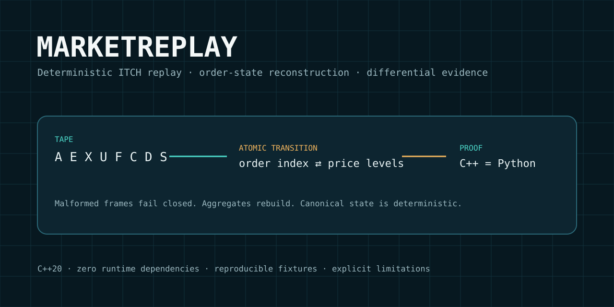
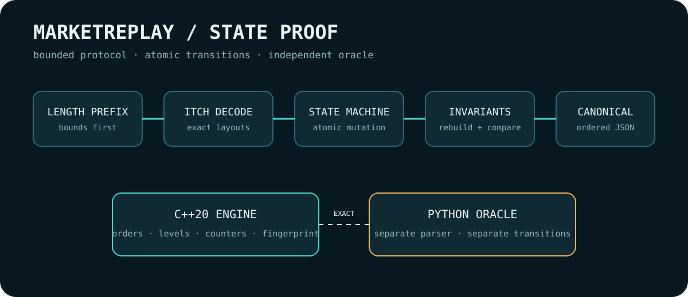

<p align="center">
  
</p>

# MarketReplay

**Deterministic TotalView-ITCH event replay, order-state reconstruction, and differential evidence.**

MarketReplay is a C++20 replay engine for a deliberately bounded subset of Nasdaq TotalView-ITCH 5.0. It parses length-prefixed binary messages, applies atomic order-state transitions, reconstructs price levels, checks invariants during replay, and emits a canonical state that must agree exactly with a separately implemented Python oracle.

> Scope is part of the design: this is not a trading strategy, a live feed handler, an exchange-certified decoder, or a claim of complete ITCH coverage.

## Why this exists

A market-data replay engine fails silently if one quantity update, replacement reference, byte offset, or malformed frame is handled incorrectly. This repository makes those errors observable through typed decoding, explicit state-machine semantics, periodic reconstruction checks, cross-language differential testing, mutation tests, deterministic fixtures, and retained benchmark evidence.

## Supported state-bearing messages

| Type | Meaning | State effect |
|---|---|---|
| `S` | System event | counted; no order mutation |
| `A`, `F` | Add order | insert active order and aggregate level |
| `E`, `C` | Execute | reduce remaining quantity; remove at zero |
| `X` | Cancel | reduce remaining quantity; remove at zero |
| `D` | Delete | remove remaining active order |
| `U` | Replace | atomically retire old reference and create new state |

Exact payload lengths and field offsets are documented in `docs/PROTOCOL.md`.

## Architecture

```text
length-prefixed tape
        │
        ▼
 bounds + type + exact-length decoder
        │
        ▼
 atomic transition engine ──► active-order index
        │                           │
        └──────────────────────────► price-level aggregates
                                    │
                                    ▼
                         reconstruction invariants
                                    │
                 ┌──────────────────┴──────────────────┐
                 ▼                                     ▼
       canonical JSON + FNV state id          independent Python oracle
                 └──────────────── exact differential ─┘
```



## Quickstart

```bash
make build
python3 scripts/generate_fixture.py --events 10000 --seed 301 \
  --output /tmp/market.itch --manifest /tmp/market.json
./build/marketreplay /tmp/market.itch --json --strict-time --check-every 257
python3 reference/oracle.py /tmp/market.itch --strict-time --check-every 257
```

## Verification

```bash
make verify
```

The release gate builds with warnings-as-errors, runs C++ and Python tests, requires exact C++/Python state identity, executes 18 differential scenarios, submits 128 deterministic corruptions, checks repeated output identity, compiles Python sources, and scans for high-risk secret patterns.

## Benchmark

```bash
make benchmark
```

The benchmark generates a seeded 500,000-message tape, requires exact state identity, records raw repetitions and environment details, and reports process-level wall-clock throughput. See `evidence/BENCHMARK.md`; do not generalize its numbers beyond the retained workload and machine.

## What was technically nontrivial

- decoding 48-bit timestamps and multiple exact binary layouts without payload copies in the transition path;
- preserving order-reference semantics across partial fills, cancellations, deletes, and replacements;
- maintaining aggregates incrementally while proving them against a recomputed state;
- designing canonical cross-language output independent of hash-map iteration order;
- making malformed data fail closed without signals or unbounded parser behavior;
- separating protocol correctness evidence from performance evidence.

## Failure archive

The first release attempt was rejected because the distribution archive named MarketReplay in reports but omitted the repository itself. This implementation treats archive membership and fresh-extraction execution as release gates. See `docs/POSTMORTEM.md`.

## Limitations

- Only the listed message subset is implemented.
- The input is a local two-byte-length-prefixed tape, not SoupBinTCP or MoldUDP64.
- No sequence-gap recovery, snapshots, multi-feed merge, market-hours policy, or live transport exists.
- The FNV-1a fingerprint detects deterministic state differences; it is not a cryptographic integrity primitive.
- Synthetic fixtures do not establish behavior on proprietary captured feeds.
- Benchmark results are machine- and workload-specific.

## Repository map

- `include/`, `src/` — C++20 decoder and replay state machine
- `reference/` — independent Python model
- `tests/` — unit and oracle tests
- `scripts/` — fixture, differential, mutation, benchmark, and release gates
- `docs/` — protocol, architecture, methodology, threat model, failure analysis
- `evidence/` — generated verification and benchmark outputs

MIT licensed. See `SECURITY.md` before reporting malformed-input or supply-chain findings.
